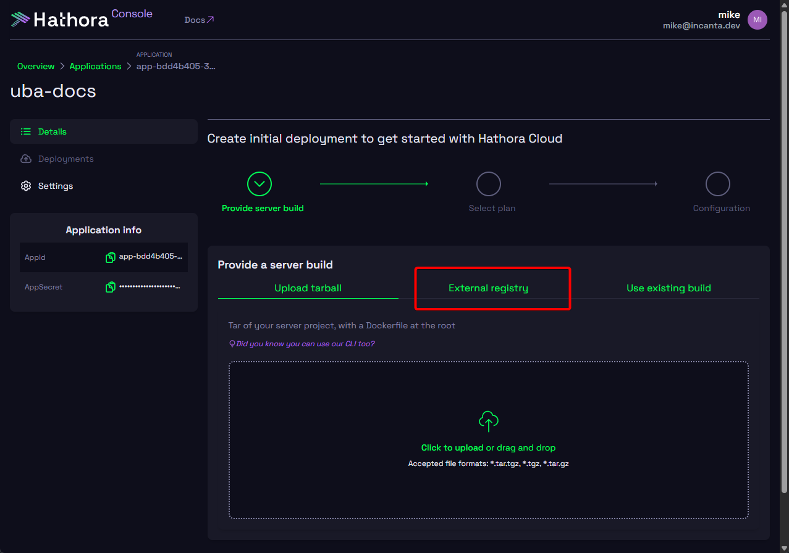
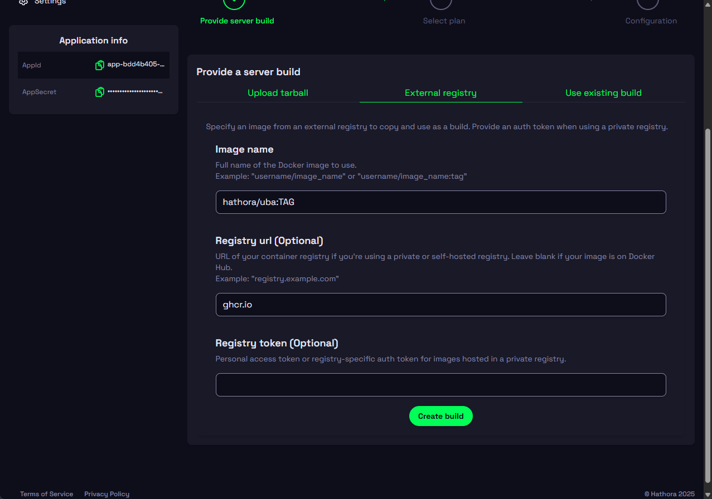
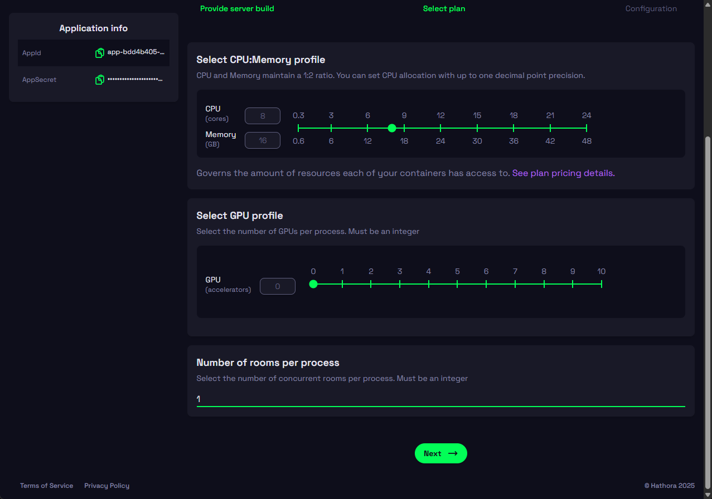
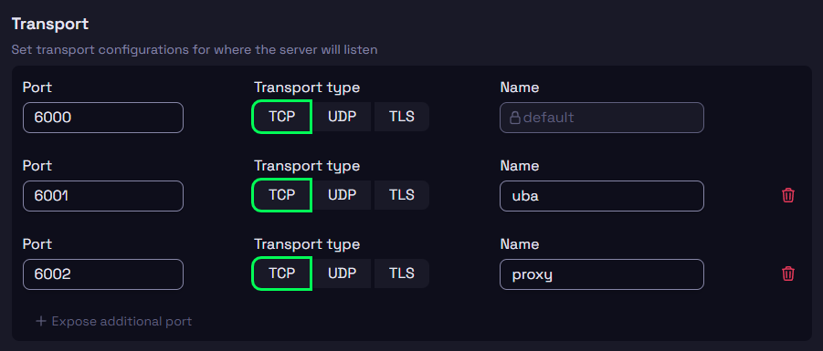
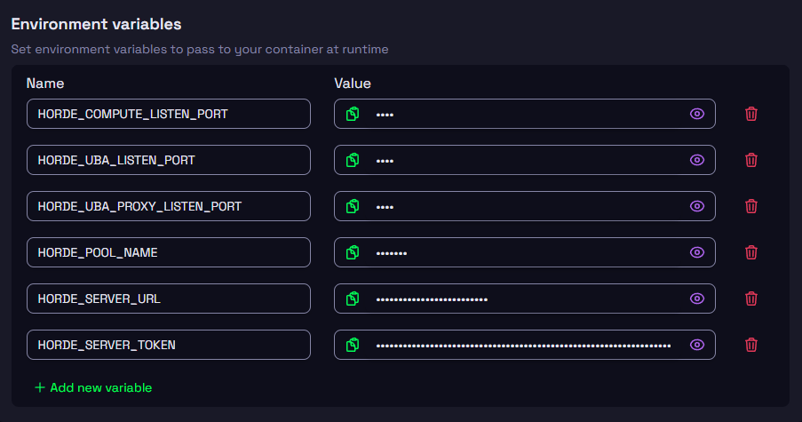

# UBA on Hathora

This repository is everything you need to get started using UBA on Hathora.

## Common Terms

**Horde:** Horde is a framework included in Unreal Engine that handles CI as well as UBA coordination.

**UBA:** Unreal Build Accelerator is a program part of Horde that enables distributed compute tasks (similar to Incredibuild and FASTBuild).

## Prerequisites

To use UBA on Hathora, you need the following:
- Using Unreal Engine 5.5.0 or greater
- A Horde Server instance (you do not need to be using the CI/Automation Jobs)

> [!NOTE]
> Your Horde Server needs to be publicly accessible; please reach out to the Hathora team if your Horde Server is behind a VPN

## Quickstart

This repo contains a lot of detailed instructions for advanced setups; this section will cover our quickest onboarding setup.

From a high-level, we'll be doing the below things:

1. Creating a Hathora [Application](https://hathora.dev/docs/how-hathora-works/hathora-entities#application) and [Build](https://hathora.dev/docs/how-hathora-works/hathora-entities#build) with the Horde Agent image
1. Modifying Unreal Engine code to support Hathora's platform
1. Configuring the Horde Server to enroll the Hathora agents
1. Configuring the Unreal project to use the correct UBA settings

This quickstart assumes you're using a [pre-built Horde server provided by Epic](https://github.com/orgs/EpicGames/packages/container/package/horde-server).

### Creating a Hathora Application and Build

1. Login to the [Hathora Console](https://console.hathora.dev), navigating to [Applications](https://console.hathora.dev/applications).
1. Press **Create Application**.
1. Enter an application name (e.g. `uba`).
1. You'll be prompted to create your initial [Deployment](https://hathora.dev/docs/how-hathora-works/hathora-entities#deployment), which is a versioned configuration of a [Build](https://hathora.dev/docs/how-hathora-works/hathora-entities#build) and its associated settings. Press **External registry** tab under the **Provide a server build** section.

    **Note:** You can build this image yourself and use **Upload tarball** instead by following [these steps](./hathora-build/README.md).

    

1. Under **Image name**, insert `hathora/uba:TAG`, replacing `TAG` with the corresponding version found in your Horde Server's dashboard **Help > Version** (e.g. `5.5.0-37571337`). You can see our current supported versions [here](https://github.com/hathora/uba/pkgs/container/uba). _For example, `hathora/uba:5.5.0-37571337`_.
1. Under **Registry url (Optional)**, insert `ghcr.io`.
1. Leave **Registry token (Optional)** blank.
1. Press **Create build**.

    

1. Wait until the **Build logs** finish and you are prompted with the [Process](https://hathora.dev/docs/how-hathora-works/hathora-entities#process) size settings (CPU, Memory, GPU, etc.).
1. Under **CPU:Memory profile**, select _at least_ 4 vCPU, we recommend 8-16+ vCPU.
1. Leave the **GPU profile** at `0`.
1. Leave the **Number of rooms per process** set to `0`.
1. Press **Next**.

    **Note:** Let us know if you need your vCPU limits increased! If you're using bare metal, you may need to configure slightly less than the desired amount to account for Hathora overhead processes (e.g. `7.8` instead of `8` vCPU or `15.7` instead of `16`).

    

1. Under **Transport**, add these port configs:

    | Port | Transport type | Name |
    | - | - | - |
    | `6000` | `TCP` | `default` |
    | `6001` | `TCP` | `uba` |
    | `6002` | `TCP` | `proxy` |

    

1. Add these **Environment variables**:

    | Name | Value |
    | - | - |
    | `HORDE_COMPUTE_LISTEN_PORT` | `6000` |
    | `HORDE_UBA_LISTEN_PORT` | `6001` |
    | `HORDE_UBA_PROXY_LISTEN_PORT` | `6002` |
    | `HORDE_POOL_NAME` | `Hathora` |
    | `HORDE_SERVER_URL` | `https://<horde-server-url>` (replace with the correct value) |
    | `HORDE_SERVER_TOKEN` | With an admin account, get this value at `https://<horde-server-url>/api/v1/admin/registrationtoken` |

    

1. You may want to set **Idle timeout** to `Disabled`, **especially if you're using bare metal**.
1. Press **Create deployment**.

### Engine Modifications

You can read more about what the engine modifications do and why they're necessary [here](./engine-modifications).

1. Download the correct patch file for your Unreal Engine version:

    - [5.5](https://github.com/hathora/uba/raw/refs/heads/main/engine-modifications/base-modifications-5.5.patch)
    - [5.6](https://github.com/hathora/uba/raw/refs/heads/main/engine-modifications/base-modifications-5.6.patch)

    **WARNING:** Do not "Select all > Copy > Paste"! Right click on the above link and select **Save link as...** (or similar).

1. Place the patch file in the root of your Unreal Engine source codebase (in the same folder as `Engine` and `Setup.bat`).
1. Run the `patch` command (replace `VERSION` appropriately):

    ```
    patch -p1 < base-modifications-VERSION.patch
    ```

    **Note:** The `patch` executable can be downloaded for Windows via the [official Git installer](https://git-scm.com/downloads/win). After installing, if you didn't add it to your PATH, you can also use:

    ```
    "C:\Program Files\Git\usr\bin\patch.exe" -p1 < base-modifications-VERSION.patch
    ```

1. Mark these files as writable in your File Explorer as they're submitted to Perforce:

    <details>

    <summary>List of files to mark as writable</summary>

    - `Engine/Binaries/Win64/UnrealBuildAccelerator/x64/UbaAgent.exe`
    - `Engine/Binaries/Win64/UnrealBuildAccelerator/x64/UbaHost.dll`
    - `Engine/Binaries/Win64/UnrealBuildAccelerator/x64/UbaHost.exp`
    - `Engine/Binaries/Win64/UnrealBuildAccelerator/x64/UbaHost.lib`

    </details>

1. Rebuild the UBA binaries:

    ```
    Engine\Build\BatchFiles\Build.bat UbaHost Win64 Development
    ```

    ```
    Engine\Build\BatchFiles\Build.bat UbaAgent Win64 Development
    ```

1. Submit the changed source files and UBA binaries to Perforce:

    <details>

    <summary>List of files to submit to Perforce</summary>

    **Both Versions**
    - `Engine/Binaries/Win64/UnrealBuildAccelerator/x64/UbaAgent.exe`
    - `Engine/Binaries/Win64/UnrealBuildAccelerator/x64/UbaHost.dll`
    - `Engine/Binaries/Win64/UnrealBuildAccelerator/x64/UbaHost.exp`
    - `Engine/Binaries/Win64/UnrealBuildAccelerator/x64/UbaHost.lib`

    **5.5**
    - `Engine/Source/Developer/UbaCoordinatorHorde/Private/UbaHordeAgent.cpp`
    - `Engine/Source/Developer/UbaCoordinatorHorde/Private/UbaHordeAgent.h`
    - `Engine/Source/Developer/UbaCoordinatorHorde/Private/UbaHordeMetaClient.cpp`
    - `Engine/Source/Developer/UbaCoordinatorHorde/Private/UbaHordeMetaClient.h`
    - `Engine/Source/Programs/Horde/HordeAgent/Services/CapabilitiesService.cs`
    - `Engine/Source/Programs/Shared/EpicGames.Horde/Compute/Clients/ServerComputeClient.cs`
    - `Engine/Source/Programs/UnrealBuildAccelerator/Common/Private/UbaSessionServer.cpp`
    - `Engine/Source/Programs/UnrealBuildTool/Executors/UnrealBuildAccelerator/UBAAgentCoordinatorHorde.cs`

    **5.6**
    - `Engine/Source/Developer/UbaCoordinatorHorde/Private/UbaHordeAgent.cpp`
    - `Engine/Source/Developer/UbaCoordinatorHorde/Private/UbaHordeAgent.h`
    - `Engine/Source/Developer/UbaCoordinatorHorde/Private/UbaHordeAgentManager.cpp`
    - `Engine/Source/Developer/UbaCoordinatorHorde/Private/UbaHordeMetaClient.cpp`
    - `Engine/Source/Developer/UbaCoordinatorHorde/Private/UbaHordeMetaClient.h`
    - `Engine/Source/Programs/Horde/Docs/Deployment/AgentSettings.md`
    - `Engine/Source/Programs/Horde/HordeAgent/AgentSettings.cs`
    - `Engine/Source/Programs/Horde/HordeAgent/Services/CapabilitiesService.cs`
    - `Engine/Source/Programs/Horde/Plugins/Compute/HordeServer.Compute/Compute/ComputeService.cs`
    - `Engine/Source/Programs/Shared/EpicGames.Horde/Compute/Clients/ServerComputeClient.cs`
    - `Engine/Source/Programs/UnrealBuildAccelerator/Common/Private/UbaSessionServer.cpp`
    - `Engine/Source/Programs/UnrealBuildAccelerator/Core/Public/UbaBinaryReaderWriter.h`
    - `Engine/Source/Programs/UnrealBuildTool/Executors/UnrealBuildAccelerator/UBAAgentCoordinatorHorde.cs`

    </details>

### Configure the Horde Server

You need to add a node pool in Horde for the Hathora agents to associate with. This is done by modifying your Horde Server's `globals.json`.

| OS | Location |
| - | - |
| Windows | `C:\ProgramData\Epic\Horde\Server\globals.json` |
| Linux/macOS | In the `Data` folder under the application directory |
| Docker | `/app/Data/globals.json` (you likely have a volume set up that maps `/app/Data` to a local directory outside of Docker) |

We also need to enable permissions to run UBA tasks from a development machine or another CI platform (Horde CI jobs don't need this, but we recommend adding it anyway).

In total, here are the changes you need to `globals.json`; make sure you merge them appropriately with existing content:

<details>

<summary>globals.json additions</summary>

``` json
{
  "plugins": {
    "compute": {
      "clusters": [
        {
          "id": "uba",
          "namespaceId": "horde.compute",
          "Condition": "pool == 'hathora'",
          "acl": {
            "entries": [
              {
                "claim": {
                  "type": "http://epicgames.com/ue/horde/group",
                  "value": "UBA"
                },
                "actions": [
                  "AddComputeTasks"
                ]
              }
            ]
          }
        }
      ],
      "pools": [
        {
          "id": "hathora",
          "name": "Hathora",
          "properties": {
            "Color": "470"
          },
          "color": "Default",
          "enableAutoscaling": false,
          "condition": "HordePoolName == 'Hathora'"
        }
      ]
    }
  },

  "acl": {
    "entries": [
      {
        "claim": {
          "type": "http://epicgames.com/ue/horde/group",
          "value": "UBA"
        },
        "profiles": [
          "run-uba"
        ],
        "actions": [
          "IssueBearerToken"
        ]
      }
    ],
    "profiles": [
      {
        "id": "run-uba"
      }
    ]
  }
}
```

**Note:** You can change the `id`, `name`, and `Color` fields in the new Hathora pool.

</details>

The above changes add a new claim for a group named `UBA`, which an admin can assign the group to the user to give them permission to use the UBA pool from their development machine:

1. Go to **Server > User Accounts** (or `https://<horde-server-url>/accounts`)
1. Press the pencil edit icon next to the user
1. In the **Edit Account** modal, find **Groups** add `UBA`
1. Click **Save**

The user should log out and log back in to the Horde dashboard before getting their auth token in the below [authentication section](#authentication).

#### Extending User Token Expiry

By default the authentication token use they use expire in 8 hours by default with no logic built in for refreshing the token. If you're using an external CI platform, you'll need to manually update the token, so it's recommended to extending this expiration. **Please consider the security implications when extending this value.**

You can extend this expiry with the `jwtExpiryTimeHours` variable in the Horde Server's `server.json` config file (same location as `globals.json`):

``` jsonc
{
  "Horde": {
    "jwtExpiryTimeHours": 168 // 168 for 7 days, 720 for 30 days, 2160 for 90 days, 8760 for 1 year
  }
}
```

### Unreal Project Configuration

Your Unreal project needs to be configured to use the Horde server and UBA pool for distributing C++ and shader compilation tasks.

<details>

<summary>Config files for 5.5 (required for 5.5 to support distributed shader compilation)</summary>

Make these changes to a respective `Engine.ini` file:
- `<engine-root>/Engine/Config/BaseEngine.ini`
- `<project-root>/Config/DefaultEngine.ini`

``` ini
[Horde]
ServerUrl=https://<horde-server-url>
; UbaPool should match the `id` field in your `globals.json`
UbaPool=hathora
UbaCluster=uba
; UbaEnabled can also be set to BuildMachineOnly, which will only be enabled if the
; `IsBuildMachine` environment variable is set to `1`. This is useful if you want to
; only have UBA run for your CI/CD machines; you'll need to configure those jobs to set
; the environment variable.
UbaEnabled=True

[UbaController]
; UbaEnabled can also be set to BuildMachineOnly, which will only be enabled if the
; `IsBuildMachine` environment variable is set to `1`. This is useful if you want to
; only have UBA run for your CI/CD machines; you'll need to configure those jobs to set
; the environment variable.
Enabled=True
; optionally add `MaxCores` to the Horde object below (defaults to 500); see `https://<horde-server-url>/docs/Tutorials/RemoteShaderCompilation.md` for details
; Pool below should match the `id` field in your `globals.json`
Horde=(Pool=hathora)
; Do not set the Host/Port settings in UbaController; these enable a different mode
```

You also need to enable the UBA Executor. This can be done by supplying the `-UBA` CLI flag in CI jobs or by adding the config variable in your `Engine/Saved/UnrealBuildTool/BuildConfiguration.xml` or `%APPDATA%/Unreal Engine/UnrealBuildTool/BuildConfiguration.xml` file:

``` xml
<?xml version="1.0" encoding="utf-8" ?>
<Configuration xmlns="https://www.unrealengine.com/BuildConfiguration">
  <BuildConfiguration>
    <bAllowUBAExecutor>true</bAllowUBAExecutor>
  </BuildConfiguration>
</Configuration>
```

</details>

<details>

<summary>Config files for 5.6+</summary>

Make these changes to a respective `Engine.ini` file:
- `<engine-root>/Engine/Config/BaseEngine.ini`
- `<project-root>/Config/DefaultEngine.ini`

``` ini
[Uba.Provider.Horde]
ServerUrl=https://<horde-server-url>
; UbaPool should match the `id` field in your `globals.json`
UbaPool=hathora
UbaCluster=uba
; UbaEnabled can also be set to BuildMachineOnly, which will only be enabled if the
; `IsBuildMachine` environment variable is set to `1`. This is useful if you want to
; only have UBA run for your CI/CD machines; you'll need to configure those jobs to set
; the environment variable.
UbaEnabled=True
```

</details>

#### Authentication

Horde CI jobs are automatically authenticated, but if you're using an external CI platform, make these changes:

- Pass the `-Unattended` CLI flag to UAT.
- Set the `UE_HORDE_URL` environment variable to `https://<horde-server-url>`
- Set the `UE_HORDE_TOKEN` environment variable to the token received at `https://<horde-server-url>/api/v1/admin/token`.

Developer machines should be prompted with a browser login to the Horde Server to authenticate. If you're getting a 405 HTTP error after you login (the page likely says something like "This page isn't working right now"), try these steps:

1. Open a tab to `https://<horde-server-url>`
1. Log out if you're logged in
1. Log in
1. Restart the build
1. Browser should open again
1. Provide your credentials again

## Horde Autoscaling

If you're interested in setting up autoscaling to scale up/down your Horde Agents on Hathora based on usage/demand, read the details in [./engine-modifications/autoscaling.md](./engine-modifications/autoscaling.md).
